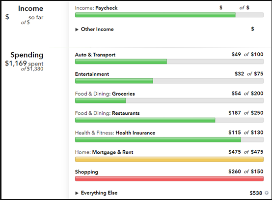
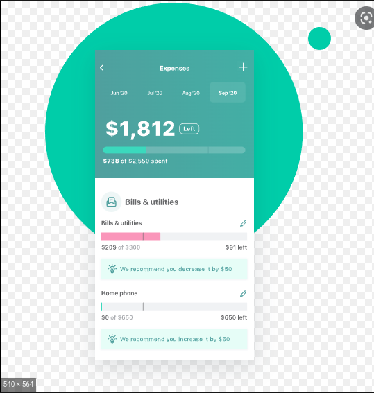

# STA 418 Final Project Proposal - Cashegories

## Overview
My idea is to make a website which I can use to organize and visualize my monthly budget. The tool will clean and categorize the data, which will be imported in the form of a CSV. The tool will use known information about my budget to categorize purchases. For example, If I know that I spend $6.99 on Disney+ every month, I can find what it looks like in the bank statement and automatically put that into my subscriptions category in my budget. Because of this, at least for now, this tool will be very specific to me and my budget. Any purchases that cannot be automatically categorized will be displayed in the app so that it can be categorized by the user. Once this data has been categorized, the app will generate graphs and visualizations of the data that it has collected. The general ideas that I have for data visualizations are:

* A pie chart to show what % of the monthly spending goes into which budget boxes
* A histogram which shows the expected/planned monthly spenging in each category
* A histogram which shows the total amount in savings over time
* A burn down chart of the total amount of money left in the budget throughout the course of the month, to show what the distribution of money spent per month throughout the month.
* A graph which shows the utiliztion of the budget (based on percentage) over time

The app will also show the total account balance, the amount of money spent already during the month, and the total cash value over budget at the current time.

Once the tool has created these summary statistics, the user will be able to export the summary statistics over all time into a csv file, stored locally on the computer, which will be able to be re-imported at the beginning of the next session along with the new CSV file. Doing it this way will allow me to avoid having to worry about cacheing data and using cookies to maintain app state between sesions.

The categorization box will contain a list of the purchases which have not been categorizd. In each listing, there will be a drop down menu containing the different titles of categories within the budget, which will allow for quick categorization. There will also be a "Create New Category" option.

I will be looking into the RVest package to see if it has any interesting web based options which will be useful for me. I will need to learn how to import and export files from within a website. I will also need to learn about all of these different types of charts and how to make them using ggplot.

The tool will have a page which will contain the breakdowns of how much money is left in each category of the budget as well, perhaps displayed as progress bars, such as in this image: 

At the end of this project, I would like to have a functional tool which I can use for my own purposes.

## Stretch Goals (If I have time)
* It would be awesome if the tool were able to make suggestions for budget changes based on previous spending habits. For example, The Mint app will make suggestions based upon previous activity, like seen in this screenshot. It would be super cool if my app were able to make suggestions like this.

* It would be nice to use IndexedDB to maintain app state between sessions, which would make the workflow of usage quite a bit easier. This would be done using: https://developer.mozilla.org/en-US/docs/Web/API/IndexedDB_API

## Categories
### Known Amount Per Month
* Rent
* Bills
    * Phone Bills
    * Subscriptions
    * Charitable Donations
    * Internet
    * Water

### Changes Every Month
* Grocery
* Entertainment 
* Personal Spending
* Gas
* Electric

### Unplanned, but can be Categorized
* Vacation
* Car Repairs
* Necessities

## Mockups
